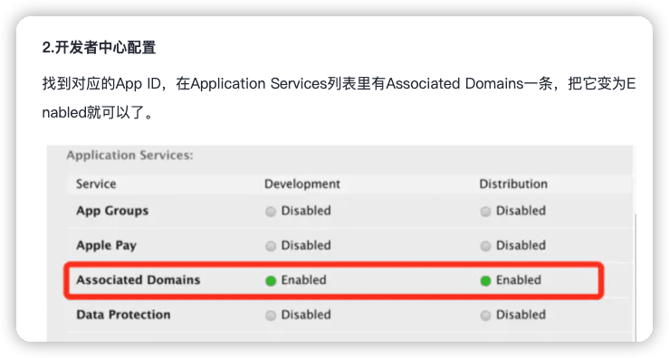
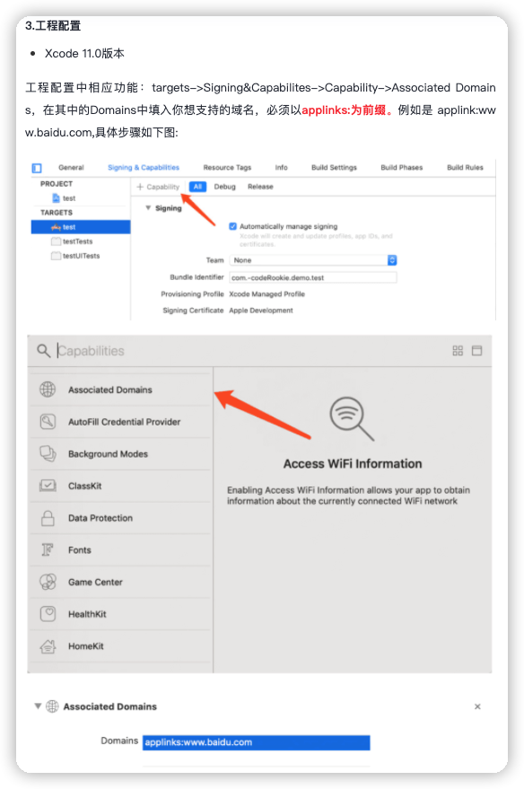

# fl_umeng_link

- 基于 fl_umeng 必须初始化友盟 `FlUMeng().init()`

- 插件已实现部分api，只需在友盟超链配置参数 和 再原生项目中配置部分配置信息

* android 配置 [具体参考官方文档](https://developer.umeng.com/docs/191212/detail/191230)
  -`android/app/src/main/AndroidManifest.xml` 中添加以下内容

```xml

<manifest xmlns:android="http://schemas.android.com/apk/res/android" package="fl.umeng.link.example">
    <application>
        <activity android:name=".MainActivity" android:configChanges="orientation|keyboardHidden|keyboard|screenSize|smallestScreenSize|locale|layoutDirection|fontScale|screenLayout|density|uiMode" android:exported="true" android:hardwareAccelerated="true" android:launchMode="singleTop" android:theme="@style/LaunchTheme" android:windowSoftInputMode="adjustResize">
            <meta-data android:name="io.flutter.embedding.android.NormalTheme" android:resource="@style/NormalTheme" />

            <intent-filter>
                <action android:name="android.intent.action.MAIN" />
                <category android:name="android.intent.category.LAUNCHER" />
            </intent-filter>

            <!--    以下需要添加内容   -->
            <intent-filter>
                <action android:name="android.intent.action.VIEW" />

                <category android:name="android.intent.category.DEFAULT" />
                <category android:name="android.intent.category.BROWSABLE" />

                <!-- 替换为自己的scheme  -->
                <data android:scheme="wellyoung://" />
            </intent-filter>
            <!--    以上需要添加内容   -->
        </activity>
    </application>
</manifest>

```

* ios 配置 [具体参考官方文档](https://developer.umeng.com/docs/191212/detail/191260#h1--universal-link6)
    - 第一种方式 (scheme)
      配置 URL Types
    - 第二种方式 (Universal link)
      
      

## 开始使用